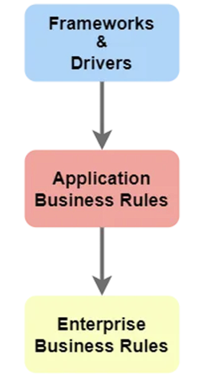

# Архитектура и структура проекта

Здесь описаны наши общие рекомендации для построения расширяемой архитектуры приложения на основе сгенерированного шаблона, а также разобраны основные моменты структуры проекта.

Естественно, выбор конкретной архитектуры зависит от настоящих требований к приложению и других технических ограничений.

## Общая архитектурная схема

Мы рекомендуем придерживаться упрощенной чистой архитектуры, которую мы разделили на 3 слоя: Frameworks and drivers, Application business rules и Enterprise business rules.

Общая схема архитектуры и потока данных представлена на рисунке ниже.



Как видно из рисунка, поток данных направлен сверху вниз.

### Frameworks and drivers

Сначала данные попадают в слой Frameworks and drivers. Здесь происходит получение и первичная валидация данных и работа с инфраструктурой проекта. К этому слою мы относим модули директорий **brokers**, **repositories**, **storage**, **web**. В директории **uows** хранятся UOW в том числе для работы с сессиями и соединениями, необходимыми для общения с другими сервисами.

### Application business rules

Данный слой представляет собой логику самого приложения. Здесь определяется как данные будут обрабатываться и задана логика выполнения сценариев приложения. Каждый сервис представляет собой отдельный класс, методы которого являются конкретным сценарием. Такие классы хранятся в директории **services**.

### Enterprise business rules

Это самый внутренний слой, в котором реализована основная бизнес-логика, отражающие реальные бизнес процессы.

Мы рекомендуем придерживаться методологии DDD и подготовили специальные интерфейсы для соответствующих сущностей в модуле **interfaces/base_domain_model.py**. Сами доменные модели хранятся в директории **models/domain**.

## Общение между слоями

Каждый слой может знать только о слое ниже. Для этого мы используем несколько подходов.

1) Использование DTO. DTO (**interfaces/base_dto.py**) позволяет хранить в себе все необходимые данные, которые будут использоваться при передаче на другой слой. Это позволяет отказаться от использования доменных моделей на уровне всего приложения, что "размазывало" бы бизнес-логику между слоями. DTO задаются в директории **models/dto**
2) Использование DI-контейнеров. DI-контейнеры позволяют уменьшить не только зацепление между отдельными частями приложения, но и разграничить слои между собой. Для этого были введены 2 контейнера - ServiceContainer (**tools/di_containers/service_container.py**) и DomainContainer (**tools/di_containers/domain_container.py**). ServiceContainer внедряется в слой Frameworks and drivers и используется для вызовов конкретных пользовательских сценариев. DomainContainer в свою очередь внедряется в сами классы сервисов, откуда вызывается для инициализации доменных моделей и вызова основной бизнес-логики

Примеры DI-контейнеров представлены ниже:
```python
from dependency_injector import containers, providers

from models.domain import entities


class ServiceContainer(containers.DeclarativeContainer):
    wiring_config = containers.WiringConfiguration(modules=["web.entrypoints.well_test_entrypoint"])
    
    # Задаем нашу реализацию сервиса
    analyze_service = providers.Factory(analyze_service.AnalyzeService)


class DomainContainer(containers.DeclarativeContainer):
    wiring_config = containers.WiringConfiguration(modules=["services.analyze_service"])
    
    # Задаем нашу реализацию доменной модели
    well_entity = providers.Factory(entities.WellEntity)
```

Теперь попробуем внедрить наши тестовые DI-контейнеры в конкретные слои:
```python
from tools.di_containers import domain_container, service_container


@router.post("/analyzeBinary")
@inject
async def analyze_binary(
    time_series: DiagnosticTimeSeries = Body(alias="timeSeries"),
    service = Provide[
        service_container.ServiceContainer.analyze_service
    ]
):
    result = await service.analyze_binary(time_series)

    ...
```

Здесь сервис внедряется в слой с API приложения. Мы получаем наш конкретный объект сервиса и вызываем его пользовательский сценарий.

```python
from tools.di_containers import domain_container, service_container


class AnalyzeService:
    @inject
    async def analyze_binary(
        time_series: DiagnosticTimeSeries,
        well = Provide[
            domain_container.DomainContainer.well_entity
        ]
    ):
        rate = well.calc_rate(time_series)
        ...
```

В этом примере мы внедрили нашу доменную модель в сервис, где вызывается основная бизнес-логика для конкретного пользовательского сценария.

## Общая структура проекта

Дополнительно к описанию модулей и пакетов, отвечающих за отдельные слои приложения, стоит упомянуть о вспомогательных модулях и директориях.
1) Директория **config**. Здесь хранятся основные конфиги для работы как с приложением, так и с инфраструктурой проекта
2) Директория **interfaces**. Здесь хранятся основные интерфейсы и базовые классы для реализации конкретных объектов
3) Директория **storage**. Здесь заданы классы для подключения к инфраструктуре проекта
4) Директория **tools**. Здесь находятся служебные объекты и утилиты, которые могут быть переиспользованы на уровне всего приложения, т.е. во всех слоях. Так, здесь хранятся DI-контейнеры, фабрики, конфигурация логгера, константы и т.д.
5) Директория **uows**. Здесь хранятся uow. Стандартные uow, которые реализованы нами, работа сосредоточена с объектами репозиториев. Однако uow может использоваться также для реализации транзакции в сложных бизнес-сценариях и т.д.
6) Директория **web**. Здесь находятся утилиты, middleware, схемы данных и эндпоинты для реализации API приложения
7) Точкой входа в приложение является модуль **main.py**. В нем передается объект приложения, которое запускается через веб-сервер **uvicorn**
8) Тесты хранятся в директории **tests**. Мы рекомендуем их реализовывать с помощью библиотеки **pytest**