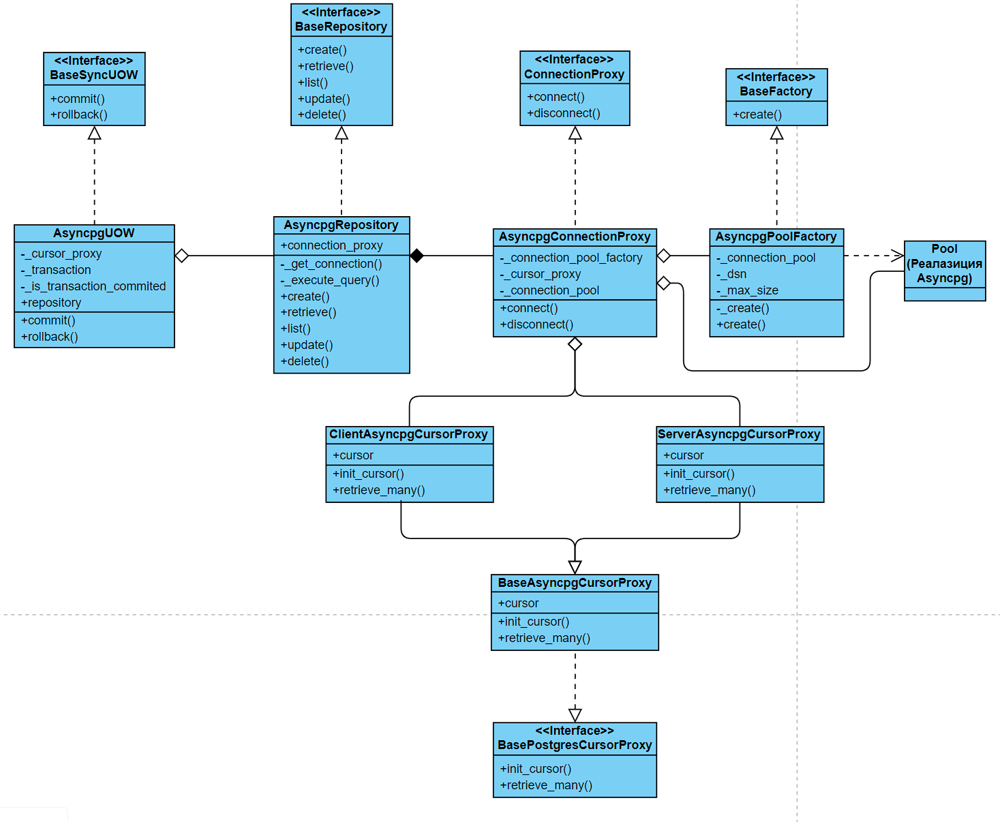

# Raw Postgres
Использование raw sql-запросов к БД Postgres реализовано через psycopg в синхронном режиме и через asyncpg - в асинхронном.
Конфиг postgres находится в **config/pg_config.py**.

## Подключение к Базе Данных

### Прокси-соединение

Предоставляются интерфейс **ConnectionProxy** из **interfaces/base_proxy.py** для синхронных и асинхронных подключений к базе данных PostgreSQL. Прокси-соединение принимает в качестве аргументов прокси для получения курсора и фабрику пулов соединений.

Основные методы:
- `connect()`: Устанавливает соединение и возвращает объект прокси-курсора.
- `disconnect()`: Разрывает текущее соединение с PostgreSQL.

### Курсор

Курсор базы данных представлен в двух вариантах: клиентский и серверный. Оба варианта реализуют интерфейс **BasePostgresCursorProxy** из **interfaces/base_postgres_cursor_proxy.py**.

Методы курсора:
- `init_cursor()`: Инициализирует курсор.
- `retrieve_many()`: Получает записи из базы данных.

## Пул Соединений

Для управления соединениями с базой данных используется пул соединений, реализованный через фабрику. Пул соединений доступен как в синхронном, так и в асинхронном вариантах.

## Репозиторий

Предлагается реализация репозитория, совместимого как с синхронными, так и с асинхронными подходами, который реализует интерфейс **BaseRepository** из **interfaces/base_repository.py**.

Основные функции:
- Конструктор принимает объект прокси-соединения.
- Содержит методы для выполнения операций с базой данных, использующие приватный метод `_execute_query()`, который получает курсор из прокси-соединения для работы с SQL-запросами.

## Unit of Work (UOW)

Для обеспечения транзакционности работы с базой данных PostgreSQL через psycopg были реализованы два класса Unit of Work (UOW) для синхронной и асинхронной реализаций.

Класс UOW функционирует как контекстный менеджер и в методе `__exit__()` вызывает:
- `commit()`: для подтверждения транзакции.
- `rollback()`: для отката транзакции в случае возникновения исключений.

## DI-контейнер

Для инициализации объекта UOW и работы с базой данных PostgreSQL через psycopg используется DI-контейнер.
Пример создания объектов в DI-контейнере:

```python
connection_pool_factory = providers.Singleton(
    psycopg_connection_pool_factory.PsycopgPoolFactory,
    config.postgres_dsn,
    config.connection_pool_size,
)
cursor_type = providers.AbstractFactory(cursor_proxy.BasePsycopgCursorProxy)
connection_proxy = providers.Factory(
    connection_proxy.PsycopgConnectionProxy, connection_pool_factory, cursor_type
)
psycopg_repository = providers.Factory(
    psycopg_repository.PsycopgSyncRepository, connection_proxy
)
psycopg_uow = providers.Factory(psycopg_uow.PsycopgSyncUOW, psycopg_repository)
```

Выбор типа курсора оставлен на усмотрение пользователя. При настройке приложения необходимо переопределить тип курсора, пример:

```python
app = FastAPI()
container = raw_postgres_container.PsycopgSyncContainer()
container.cursor_type.override(providers.Factory(psycopg_cursor_proxies.ClientPsycopgCursorProxy))
app.container = container
```

Далее происходит получение прокси-соединения, которое принимает аргументами объекты фабрики пулов и прокси-курсора.
Как только был получен объект прокси-соединения, инициализируется объект репозитория, 
который является аргументов для инициализатора объекта UOW.

В асинхронном варианте с библиотекой asyncpg используется аналогичная цепочка создания объектов.

## Пример использования psycopg UOW через DI-контейнер


```python
# some code

@inject
def psycopg_example(
    uow: PsycopgSyncUOW = Provide[PsycopgSyncContainer.psycopg_uow]
):
    with uow as u:
        u.repository.create(...)
        
# some code
```

## Механизм взаимодействия классов

В этом разделе подробно рассматриваются классы, необходимые для работы с raw SQL-запросами к базе данных PostgreSQL.

### UOW (Unit of Work)

Для управления транзакциями в проекте предусмотрены два класса:
- **PsycopgSyncUOW**: для синхронного подключения.
- **AsyncpgUOW**: для асинхронного подключения.

Оба класса реализуют интерфейсы:
- **BaseSyncUOW** (для PsycopgSyncUOW).
- **BaseAsyncUOW** (для AsyncpgUOW).

**Общие поля в обоих классах:**
- **repository**: хранит объект репозитория.
- **_cursor_proxy**: инициализируется как **None**.

**Основные аспекты работы с UOW:**
- При вызове контекстного менеджера поле **_cursor_proxy** ссылается на объект курсора, получаемый от прокси-объекта соединения, принадлежащего репозиторию.
- Это разделение позволяет использовать объект репозитория независимо от UOW, что не требует от UOW знания о подключении.
- Инициализация **_cursor_proxy** происходит только при входе в контекстный менеджер, что позволяет экономить ресурсы при подключении к базе данных.

**Отличия AsyncpgUOW от PsycopgSyncUOW:**
- **AsyncpgUOW** содержит дополнительные поля для работы с транзакциями:
  - **_transaction**: объект транзакции.
  - **_is_transaction_commited**: статус завершения транзакции.

Использование отдельного объекта транзакции связано с особенностями библиотеки **asyncpg**, которая требует работы с транзакциями в контексте подключения. Важно помнить об их своевременном закрытии.

### Репозиторий

В проекте реализованы два базовых класса репозитория:
- **PsycopgSyncRepository**: для синхронной работы с PostgreSQL.
- **AsyncpgRepository**: для асинхронной работы.

Оба класса реализуют интерфейс **BaseRepository**.

**Основные аспекты работы с репозиторием:**
- Для начала работы необходимо инициализировать поле **connection_proxy**, которое содержит объект соединения и контролирует его работу.
- Репозитории не хранят в себе объект курсора или соединения. Вместо этого необходимо использовать защищённый метод **_get_connection** для получения нужного объекта. Это решение направлено на:
  - Обеспечение безопасности.
  - Уменьшение числа проверок.
  - Инкапсуляцию логики подключения.

Соединение может быть разорвано как по причинам, не зависящим от пользователя, так и по его инициативе. Поэтому рекомендуется использовать объект-посредник для интерфейса подключения.

**Методы взаимодействия с базой данных:**
- Большинство методов репозиториев используют защищённый метод **_execute_query**, который инкапсулирует типичную логику выполнения запросов с использованием курсора.
- Метод **_execute_query** не использует метод **list**, потому что работает только с прокси-курсором, извлекая данные из базы либо целиком (client-side cursor), либо батчами (server-side cursor).

*Работа прокси-курсора подробно будет рассмотрена ниже.*

## Прокси-соединение

Прокси-соединение представляет собой объект, реализующий интерфейс **ConnectionProxy**. В зависимости от подхода используются следующие классы прокси-соединений:
- **PsycopgConnectionProxy**: для синхронного подключения.
- **AsyncpgConnectionProxy**: для асинхронного подключения.

**Основные функции прокси-соединений:**
- Инициализация пула соединений.
- Инициализация прокси-курсона.

При вызове метода **connect**:
- Соединение извлекается из пула.
- Инициализируется курсор в прокси-объекте курсора.
- Метод возвращает прокси-объект курсора, с помощью которого пользователь может выполнять запросы к базе данных.

Метод **disconnect** выполняет следующие действия:
- Закрывает курсор.
- Возвращает соединение обратно в пул.

Прокси-соединения могут работать как с client-side, так и с server-side курсорами. Выбор типа курсора регулируется при инициализации прокси-соединения.

## Прокси-курсор

Прокси-курсоры наследуют классы в зависимости от типа подключения:
- **BasePsycopgCursorProxy**: для синхронного подключения.
- **BaseAsyncpgCursorProxy**: для асинхронного подключения.

Базовые классы реализуют интерфейс **BasePostgresCursorProxy**.

**Методы интерфейса включают:**
- Инициализация курсора.
- Получение данных из базы данных с использованием выбранного курсора.

Если потребуется добавить новую операцию, зависящую от курсора, можно расширить интерфейс **BasePostgresCursorProxy** необходимым методом.

**Особенности реализации:**
- В psycopg `server-side` курсор может выполнять только операцию `SELECT`, поэтому его инициализация вынесена в метод **retrieve_many**, который используется исключительно для этой операции. В остальных случаях прокси-курсор работает с `client-side` курсором.
- В реализации asyncpg понятие `client-side` курсора отсутствует, поэтому для выполнения запросов используется объект соединения напрямую. Точно так же, как и в psycopg, `client-side` курсор инициализируется только в методе **retrieve_many**.

Метод **retrieve_many** представляет собой генератор, который возвращает количество строк из базы данных, заданное пользователем.

В результате:
- Для синхронных запросов реализованы классы:
  - **ClientPsycopgCursorProxy**
  - **ServerPsycopgCursorProxy**
- Для асинхронных запросов:
  - **ClientAsyncpgCursorProxy**
  - **ServerAsyncpgCursorProxy**

Такое четкое разделение по классам позволяет гибко настраивать объекты прокси-соединений для работы с различными типами курсоров. Репозитории же принимают только один тип прокси-соединения — синхронный или асинхронный.

### Общая UML-диаграмма классов на примере асинхронной реализации Asyncpg


## Работа без DI-контейнера на примере асинхронной реализации

```python
from repositories import asyncpg_repository
from storage.raw_postgres import connection_proxy
from storage.raw_postgres.cursor_proxies import asyncpg_cursor_proxies
from tools.factories import asyncpg_connection_pool_factory
from uows import asyncpg_uow

# Создание фабрики пулов соединений
dsn = "postgresql://localhost/mydb?user=pg&password=secret"
max_size = 10

pool_factory = asyncpg_connection_pool_factory.AsyncpgPoolFactory(dsn, max_size)

# Создание прокси-курсора
cursor_proxy = asyncpg_cursor_proxies.ClientAsyncpgCursorProxy()

# Создание прокси-соединения
connection_proxy = connection_proxy.AsyncpgConnectionProxy(pool_factory, cursor_proxy)

# Создание репозитория
repository = asyncpg_repository.AsyncpgRepository(connection_proxy)

# Создание UOW
async_uow = asyncpg_uow.AsyncpgUOW(repository)

# Использование UOW
## Моковая БД
users = [
    {"name": "Sam", "phone": "32283228"},
    {"name": "Tom", "phone": "88005553535"},
    {"name": "Mike", "phone": "4242"},
]

## Запросы
select_sql = """
    SELECT *
    FROM users u
    WHERE u.name is not $1
    WHERE u.name != $1
"""

select_one_sql = """
    SELECT *
    FROM users u
    WHERE u.name = $1
"""

insert_sql = """
    INSERT INTO users (name, phone) VALUES ($1, $2)
"""

delete_sql = """
    DELETE FROM users
    WHERE name = $1
"""

update_sql = """
    UPDATE users
    SET phone = $1
    WHERE name = $2
"""

async def async_create() -> None:
    """
    Создать пользователей
    """

    async with async_uow as uow:
        for user in users:
            await uow.repository.create(insert_sql, params=user.values())

        await uow.commit()


async def async_get_list() -> list:
    """
    Получить список пользователей
    :return: список пользователей
    """

    async with async_uow as uow:
        gen = await uow.repository.list(select_sql, 3, ["Ted"])
        users = []

        async for row in gen:
            users.append(row)

        return users


async def async_get_one() -> dict:
    """
    Получить одну строку
    :return: одна строка
    """

    async with async_uow as uow:
        return await uow.repository.retrieve(select_one_sql, ["Sam"])


async def async_delete() -> None:
    """
    Удалить строки
    """

    async with async_uow as uow:
        for user in users:
            await uow.repository.delete(delete_sql, params=[user["name"]])

        await uow.commit()


async def async_update():
    """
    Обновить данные
    """

    async with async_uow as uow:
        return await uow.repository.update(update_sql, ["9999999", "Sam"])
```
